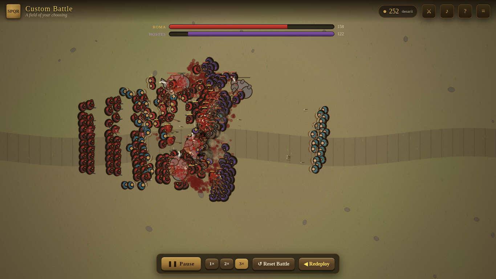
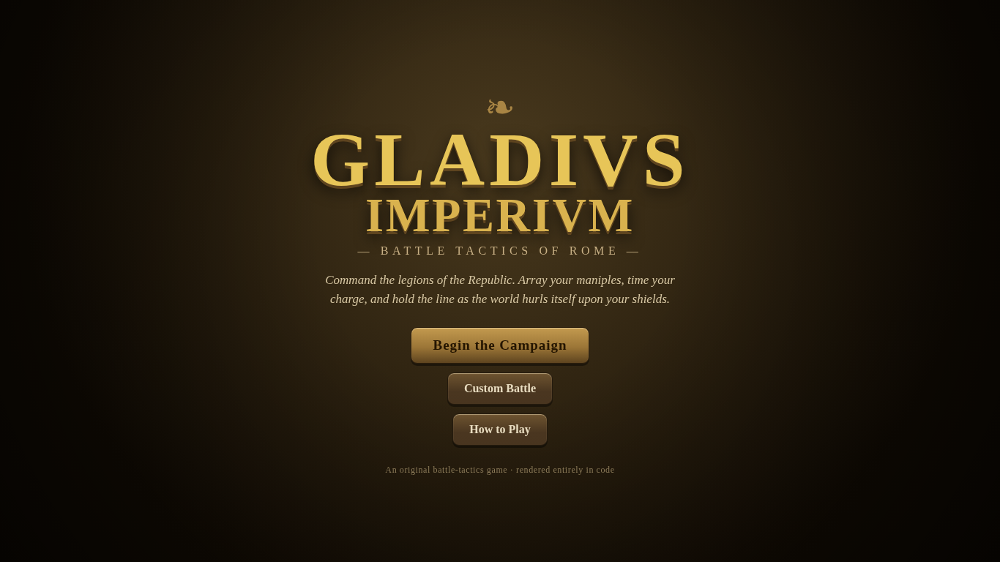
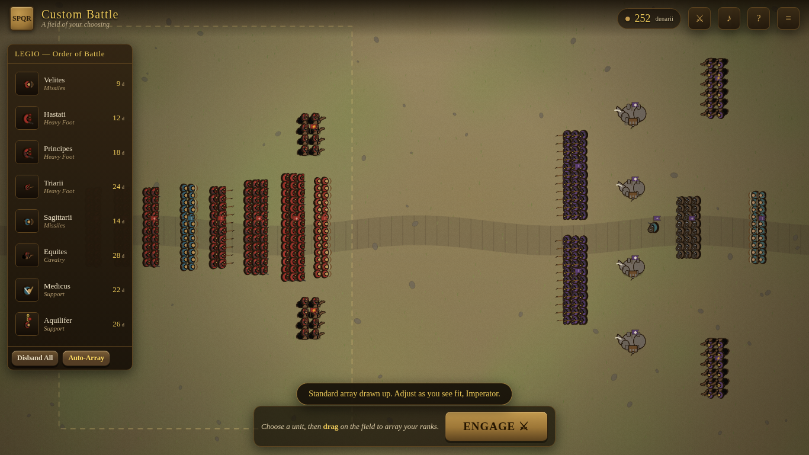
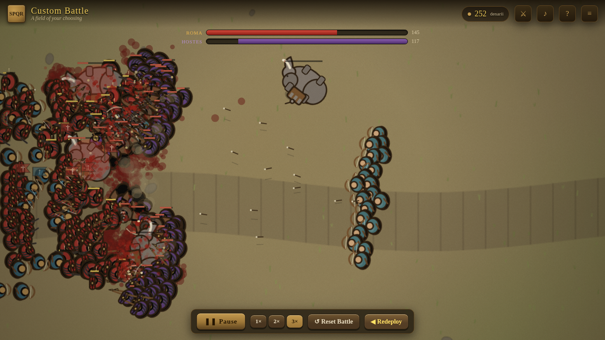

# ⚔ GLADIVS IMPERIVM — Battle Tactics of Rome

A physics-based tactical battle game set in the Roman era. Spend a purse of
denarii arraying maniples of legionaries, then watch a real-time mass battle
play out — momentum, shoving, morale and routing and all — and try to break the
enemy before your own line gives way.

It is built in the spirit of *Winter Falling: Battle Tactics*: the same
two-phase loop of **deploy, then fight**, the same "it's a puzzle you solve with
composition and positioning, and you may retry freely" feel — re-imagined for
the legions of the Republic, and rendered in a deliberately ancient, fresco /
woodcut style rather than anything modern.

**Everything you see and hear is generated in code.** There are no image, sprite,
audio, or font asset files anywhere in this project — every soldier, war
elephant, battlefield, war-horn and clash of swords is drawn or synthesised at
runtime. No frameworks, no build step, no dependencies.



| | |
|---|---|
|  |  |
|  |  |

---

## ▶ How to run

No build, no server, no install. Just open the file:

```
Open  index.html  in any modern browser.
```

(For the carved title font to load you need an internet connection, but it falls
back gracefully to a serif if offline. If your browser is strict about
`file://`, serve the folder with `python3 -m http.server` and visit
`http://localhost:8000`.)

---

## ✦ Features

Everything *Winter Falling* is loved for, given a Roman skin:

- **Two-phase battles** — a deployment phase where you spend denarii drawing up
  formations, then a live battle that runs on its own. Your tactics are decided
  *before* the first blow.
- **Draw your formations** — pick a unit and **drag** on the field to array a
  block of men. A wider drag makes a broader line; a deeper drag adds ranks.
  Cost scales with the number of soldiers.
- **Real-time physics melee** — hundreds of independent soldiers steer, shove,
  lock shields and fight. Lines form and buckle emergently; cavalry charges land
  with momentum and knockback; war elephants trample whole ranks flat.
- **Morale & routing** — every soldier has nerve. A formation that loses too many
  men breaks and *routs*, and routers get ridden down. Encircle a unit, hit it in
  the flank or rear (extra damage!), or kill its leader and watch the line fold.
- **Pause & speed control** — pause and ponder at any moment, or watch at
  **1× / 2× / 3×**.
- **A campaign** — ten hand-built scenarios with an escalating Roman narrative,
  from a Gallic frontier raid to the elephants of Carthage and the field of Zama.
  Each shows you the enemy host up front; progress is saved.
- **Free retries** — **Reset Battle** re-runs the same plan; **Redeploy** lets you
  adjust it. Solve each fight at your own pace.
- **Custom Battle** — a sandbox: summon any enemy host you like, set your purse,
  and take the field.
- **Pan & zoom** camera, army-strength bars, an enemy intelligence readout, unit
  banners, blood, dust, spent arrows and the dead piling up on the ground.

---

## 🎮 Controls

| Action | Control |
|---|---|
| Select a unit to place | Click it in the roster |
| Array a formation | **Drag** across the field (in your green zone) |
| Select / inspect a placed formation | Click it (in select mode) |
| Disband a formation (refund) | Select it → **Disband**, or `Delete` |
| Pan the camera | **Right-drag**, or `W A S D` / arrow keys |
| Zoom | Mouse wheel, or `+` / `-` |
| Begin the battle | **Engage**, or `Enter` |
| Pause / play | `Space` |
| Battle speed | `1` `2` `3` |
| Reset the battle | `R` |
| Cancel / close | `Esc` |

---

## 🛡 The Roman roster

| Unit | Role | Notes |
|---|---|---|
| **Velites** | Skirmishers | Cheap. Hurl javelins, then fall back. Weak in a melee. |
| **Hastati** | Heavy foot | The backbone of the line — gladius and scutum. |
| **Principes** | Heavy foot | Seasoned, armoured, hit harder and hold longer. |
| **Triarii** | Spearmen | A wall of points that **shatters cavalry**. Slow. |
| **Sagittarii** | Archers | Long reach, endless arrows; helpless if caught. |
| **Equites** | Cavalry | A thunderous charge. Breaks flanks, runs down routers — but dies on braced spears. |
| **Medicus** | Support | Mends nearby soldiers over time. The heart of "pull and heal". |
| **Aquilifer** | Support | Bears the Eagle; steadies every legionary near it so the line won't break. |

…against Gallic warriors and hunters, fearless Germanic **berserkers**, tribal
chieftains, the Carthaginian Libyan **phalanx**, swarming **Numidian** light
horse, and the dreaded **war elephants** — which, when wounded, panic and
rampage back through their own army.

## ⚑ A few tactics

- A disciplined Roman line beats an equal number of barbarians in a fair grind —
  so make them fight fair. Don't let loose, fast tribes envelop your flanks.
- Never charge cavalry into braced spears, and never march a dense block straight
  into a charging elephant — give it a lane, and panic it with missiles.
- Win one flank first, then roll the enemy line up from the side. Flank and rear
  attacks hit far harder than a frontal push.

---

## 🛠 Under the hood

Pure HTML5 Canvas + vanilla JavaScript, hung off a single `GI` global so it runs
straight from `file://`.

- **Procedural sprites** (`js/sprites.js`) — each soldier, horse and elephant is
  painted in code in a fresco/woodcut idiom, baked once per unit type (with
  jittered variants) into offscreen canvases and rotate-blitted, so hundreds of
  men stay at 60fps.
- **Procedural audio** (`js/audio.js`) — every clash, war-horn, drum and elephant
  trumpet is synthesised with the WebAudio API. No sound files.
- **Procedural battlefield** (`js/renderer.js`) — terrain, grass, rocks, a worn
  Roman road and a parchment vignette, all drawn at load time.
- **The simulation** (`js/soldier.js`, `js/battle.js`) — autonomous agents using
  classic steering (seek / cohesion / separation), a spatial hash grid for
  neighbour queries, a formation-casualty morale model, and a fair two-pass tick
  (think, then move; deaths resolve at end of tick) so combat is order-independent
  and a mirror match is a true coin-flip.

```
index.html              page + canvas + UI shell
css/style.css           the aged, imperial look
js/utils.js             math, seeded RNG, spatial grid, camera
js/audio.js             synthesised sound
js/units.js             the roster and its stats
js/sprites.js           procedural figure painter
js/effects.js           projectiles + particles
js/soldier.js           one fighting man: AI, morale, physics
js/battle.js            the simulation engine
js/levels.js            the campaign
js/renderer.js          drawing the world
js/game.js              state machine, input, main loop
js/ui.js                HUD, roster, screens
js/main.js              bootstrap
```

## 🧪 Tests

Self-contained Node scripts that run the real simulation headlessly to check
balance and fairness (no dependencies):

```
node test/headless.js     # unit-matchup balance across many seeds
node test/campaign.js     # every campaign level vs an auto-arrayed army
```

An optional Playwright integration test (`test/smoke.mjs`) drives the actual
game in a browser if you have Playwright installed.

---

*An original game inspired by the battle-tactics genre. All code, art and audio
herein are generated from scratch — no third-party assets are used.*
